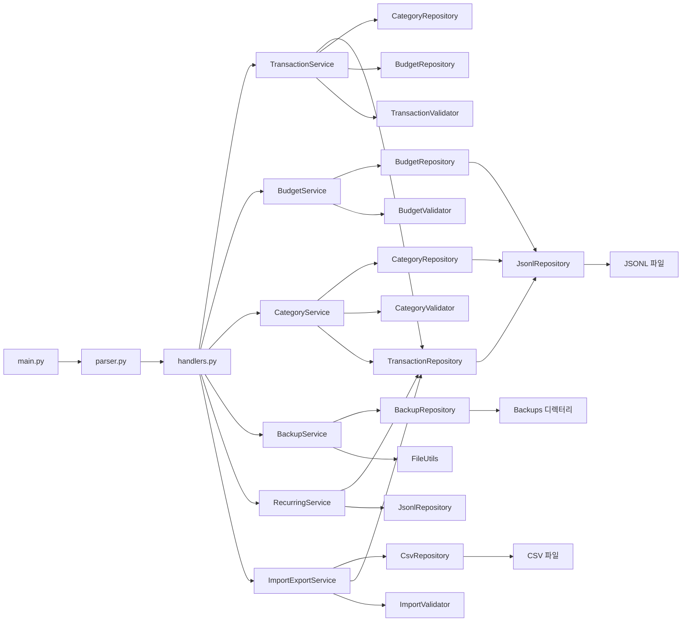

# 파일 입출력 기반 파이썬 가계부 콘솔 프로그램

## 1. 개요
- 본 문서는 파일 입출력 기반의 가계부 콘솔 프로그램을 구현하기 위한 **설계·명세 문서**이다.
- 데이터는 JSONL/CSV를 기반으로 저장하며, 외부 라이브러리를 사용하지 않는다.
- 기본 동작은 **대화형 입력**이고 **옵션 기반 CLI**를 병행한다.

## 2. 목표
- 거래 추가, 조회, 검색, 요약, 예산, 카테고리, 수정, 삭제, import/export, 백업, 반복 내역 관리 기능을 제공한다.
- CLI, 서비스, 저장소, 모델, 검증, 오류 처리, 유틸리티를 계층적으로 분리한다.
- 문서와 구현의 용어를 일치시켜 유지보수와 리뷰가 쉬운 구조를 만든다.

## 3. 기능 명세

#### add
- 입력/요청: 대화형 입력(날짜, 타입, 카테고리, 금액, 메모, 태그)
- 출력/화면: 저장 성공 메시지와 생성된 거래 ID
- 동작:
  - `add` 실행 시 `input()`을 통해 필드를 순차 입력받는다.
  - 카테고리는 사전에 등록된 값만 허용한다.
  - 저장 완료 시 생성된 `id`를 출력한다.

#### list
- 입력/요청: `--limit N`
- 출력/화면: 최신순 거래 목록
- 동작:
  - 최신 순으로 거래를 출력한다.
  - `--limit` 기본값을 제공한다.
  - 메모리 효율을 위해 스트리밍 방식으로 처리한다.

#### search
- 입력/요청: `--from`, `--to`, `--category`, `--type`, `--q`, `--tag`
- 출력/화면: 조건에 맞는 거래 목록
- 동작:
  - 날짜 범위, 카테고리, 타입, 메모 키워드, 태그 조건을 조합 지원한다.
  - 검색 결과는 최신순으로 정렬한다.

#### summary
- 입력/요청: `--month YYYY-MM`, `--top N`
- 출력/화면: 총수입, 총지출, 잔액, 카테고리별 지출 TOP N
- 동작:
  - 지정한 월의 요약을 출력한다.
  - 데이터가 없으면 명확히 `데이터 없음`을 출력한다.

#### update
- 입력/요청: `update --id <id> [--date ...] [--type ...] [--category ...] [--amount ...] [--memo ...] [--tags ...]`
- 출력/화면: 수정 성공/실패 메시지
- 동작:
  - 존재하지 않는 `id`는 사용자에게 안내한다.
  - 파일 저장 시 원자적 갱신 정책을 적용한다.

#### delete
- 입력/요청: `delete --id <id>`
- 출력/화면: 삭제 성공/실패 메시지
- 동작:
  - 존재하지 않는 `id`는 사용자에게 안내한다.
  - 원자적 저장 정책을 적용한다.

#### budget
- 입력/요청: `budget set --month YYYY-MM --amount 금액`
- 출력/화면: 예산 저장 결과와 `summary`에서 예산 사용률/초과 경고
- 동작:
  - 예산은 영구 저장한다.
  - `summary` 시 예산 대비 사용률과 초과 여부를 함께 표시한다.

#### category
- 입력/요청: `category add`, `category list`, `category remove`
- 출력/화면: 카테고리 추가/조회/삭제 결과
- 동작:
  - 사용 중인 카테고리는 삭제하지 못하도록 보호한다.

#### import / export
- 입력/요청:
  - `import --from <csv>`
  - `export --out <csv> [--month YYYY-MM] [--from YYYY-MM-DD] [--to YYYY-MM-DD]`
- 출력/화면: 처리 건수와 생성/반영 결과
- 동작:
  - CSV 헤더를 기준으로 거래를 읽고 쓴다.
  - 필터를 적용해 원하는 범위만 export 한다.

#### backup
- 입력/요청: `backup`
- 출력/화면: 백업 파일 생성 결과 및 저장 경로
- 동작:
  - 타임스탬프를 포함한 백업 파일을 생성한다.

#### recurring
- 입력/요청: `recurring add`, `recurring list`, `recurring run --month YYYY-MM`
- 출력/화면: 반복 규칙 등록 및 월별 자동 생성 결과
- 동작:
  - 반복 규칙을 저장하고 지정 월에 거래를 생성한다.

#### table-format
- 입력/요청: 기본 출력 시 자동 적용
- 출력/화면: 표 형태로 정렬된 거래 목록
- 동작:
  - 외부 라이브러리 없이 문자열 정렬로 컬럼 정렬을 수행한다.

#### help
- 입력/요청: `<command> --help`
- 출력/화면: 명령어별 상세 사용법

## 4. 실행 방식

### 4.1 기본 실행 모드
- **대화형 기본**: `add`, `category add`
- **옵션 기반 기본**: `list`, `search`, `summary`, `update`, `delete`, `export`, `import`, `help`
- **명령 기반 기본**: `category list`, `category remove`, `backup`, `recurring`

### 4.2 옵션 표기 규칙
- 모든 옵션은 `--` 형식으로 통일한다.
- 사용 예: `--help`, `--limit`, `--from`, `--to`, `--month`, `--category`, `--type`, `--q`, `--tag`, `--amount`, `--date`, `--memo`, `--tags`

## 5. 아키텍처 및 책임 분산

### 5.1 계층 구조
- **CLI 레이어**: 명령어 파싱, 입력 수집, 라우팅, 화면 출력
- **서비스 레이어**: 도메인 규칙, 워크플로우 조합, 저장소 호출
- **모델 레이어**: 거래, 예산, 카테고리, 반복 규칙, 백업 메타데이터
- **저장소 레이어**: 파일 읽기/쓰기, JSONL/CSV 변환, 백업 관리
- **검증 레이어**: 입력 형식, 범위, 존재 여부 검증
- **오류 처리 레이어**: 예외를 사용자 친화 메시지로 변환
- **유틸리티 레이어**: 날짜, 파일, 출력, 데코레이터, 열거형 정규화

### 5.2 Affinity와 책임 분산
- 거래 관련 책임은 `TransactionService`와 `TransactionRepository`에 집중 배치한다.
- 예산, 카테고리, 백업, 반복 내역은 각각 독립된 서비스·리포지토리 조합으로 분리한다.
- 변경 범위가 작은 계층 단위로 작업하도록 설계한다.

### 5.3 권장 파일 트리
```text
project-root/
├── README.md
├── app/
│   ├── __main__.py
│   ├── __init__.py
│   ├── cli/
│   │   ├── __init__.py
│   │   ├── parser.py
│   │   ├── handlers.py
│   │   └── renderer.py
│   ├── services/
│   │   ├── __init__.py
│   │   ├── transaction_service.py
│   │   ├── budget_service.py
│   │   ├── category_service.py
│   │   ├── backup_service.py
│   │   ├── recurring_service.py
│   │   └── import_export_service.py
│   ├── repositories/
│   │   ├── __init__.py
│   │   ├── transaction_repository.py
│   │   ├── budget_repository.py
│   │   ├── category_repository.py
│   │   ├── backup_repository.py
│   │   ├── csv_repository.py
│   │   └── jsonl_repository.py
│   ├── models/
│   │   ├── __init__.py
│   │   ├── transaction.py
│   │   ├── budget.py
│   │   ├── category.py
│   │   ├── recurring_rule.py
│   │   └── backup_metadata.py
│   ├── validators/
│   │   ├── __init__.py
│   │   ├── input_validator.py
│   │   ├── transaction_validator.py
│   │   ├── budget_validator.py
│   │   ├── category_validator.py
│   │   └── import_validator.py
│   ├── errors/
│   │   ├── __init__.py
│   │   ├── app_error.py
│   │   ├── error_handler.py
│   │   └── error_context.py
│   └── utils/
│       ├── __init__.py
│       ├── date_utils.py
│       ├── validation_utils.py
│       ├── file_utils.py
│       ├── formatter_utils.py
│       ├── decorator_utils.py
│       └── enum_utils.py
├── data/
│   ├── transactions.jsonl
│   ├── categories.jsonl
│   └── budgets.jsonl
├── backups/
└── tests/
    ├── __init__.py
    ├── test_cli.py
    ├── test_services.py
    ├── test_repositories.py
    └── test_validators.py
```

### 5.4 디렉터리별 책임
- `app/cli/`: 명령 파싱, 라우팅, 렌더링
- `app/services/`: 비즈니스 로직과 워크플로우 조합
- `app/repositories/`: 파일 읽기/쓰기 및 CRUD 처리
- `app/models/`: 데이터 클래스 및 도메인 구조
- `app/validators/`: 입력 형식과 도메인 규칙 검증
- `app/errors/`: 예외 표현과 사용자 친화 메시지 변환
- `app/utils/`: 공용 유틸리티 및 데코레이터

## 6. CLI 명령어 호출 흐름
1. `main.py`가 `parser.py`를 초기화하고 `handlers.py`를 생성한다.
2. `parser.py`가 명령어와 옵션을 파싱한다.
3. `handlers.py`는 서비스 계층으로 요청을 위임한다.
4. `renderer.py`가 출력 형식을 담당한다.
5. 서비스는 저장소와 검증 계층에만 의존한다.

### 6.1 명령어별 흐름
- `add`: `handle_add()` → `TransactionValidator` → `TransactionService.add_transaction()` → `TransactionRepository.append()` → `renderer.render_message()`
- `list`: `handle_list()` → `TransactionService.list_transactions()` → `TransactionRepository.filter()` → `renderer.render_transaction_table()`
- `search`: `handle_search()` → `TransactionService.search_transactions()` → `TransactionRepository.filter()` → `renderer.render_transaction_table()`
- `summary`: `handle_summary()` → `TransactionService.get_summary()` + `BudgetService.calculate_usage_ratio()` → `renderer.render_summary()`
- `budget set`: `handle_budget_set()` → `BudgetValidator` → `BudgetService.set_budget()` → `BudgetRepository.upsert()`
- `category add/list/remove`: `CategoryService` 및 `CategoryRepository`를 경유
- `update`: `handle_update()` → `TransactionValidator` → `TransactionService.update_transaction()` → `TransactionRepository.update()`
- `delete`: `handle_delete()` → `TransactionService.delete_transaction()` → `TransactionRepository.delete()`
- `import`: `handle_import()` → `ImportValidator` → `ImportExportService.import_csv()` → `CsvRepository` + `TransactionRepository`
- `export`: `handle_export()` → `ImportExportService.export_csv()` → `TransactionRepository.filter()` + `CsvRepository.write_csv()`
- `backup`: `handle_backup()` → `BackupService.create_backup()` → `BackupRepository.create_backup()`
- `recurring`: `handle_recurring()` → `RecurringService` → `TransactionRepository.append()`

## 7. 함수/메서드 정의

### 7.1 CLI
- `main()`: 앱 실행 진입점
- `build_parser()`: 서브커맨드와 옵션 정의
- `parse_args(argv)`: CLI 인자 파싱
- `show_help(command=None)`: 명령어별 도움말 출력
- `handle_add(args)`, `handle_list(args)`, `handle_search(args)`, `handle_summary(args)`
- `handle_budget_set(args)`, `handle_category_add(args)`, `handle_category_list(args)`, `handle_category_remove(args)`
- `handle_update(args)`, `handle_delete(args)`, `handle_import(args)`, `handle_export(args)`, `handle_backup(args)`, `handle_recurring(args)`
- `render_transaction_table(transactions)`, `render_summary(summary)`, `render_budget_status(budget)`, `render_message(message)`, `render_error(error)`

### 7.2 서비스
- `TransactionService.add_transaction(input_data)`
- `TransactionService.update_transaction(transaction_id, input_data)`
- `TransactionService.delete_transaction(transaction_id)`
- `TransactionService.list_transactions(filters=None)`
- `TransactionService.search_transactions(filters=None)`
- `TransactionService.get_summary(filters=None)`
- `BudgetService.set_budget(month, amount)`
- `BudgetService.get_budget(month)`
- `BudgetService.calculate_usage_ratio(month)`
- `CategoryService.add_category(name)`
- `CategoryService.remove_category(name)`
- `CategoryService.list_categories()`
- `BackupService.create_backup(target_path=None)`
- `BackupService.restore_backup(backup_path)`
- `RecurringService.register_rule(rule_data)`
- `RecurringService.list_rules()`
- `RecurringService.run_due_rules(current_month)`
- `ImportExportService.import_csv(file_path)`
- `ImportExportService.export_csv(file_path, filters=None)`

### 7.3 저장소
- `TransactionRepository.load_all()`, `save_all(transactions)`, `append(transaction)`, `update(transaction_id, updated_transaction)`, `delete(transaction_id)`, `filter(filters=None)`
- `BudgetRepository.load_all()`, `save_all(budgets)`, `upsert(budget)`
- `CategoryRepository.load_all()`, `save_all(categories)`, `append(category)`, `delete(category_name)`
- `BackupRepository.create_backup(source_files, target_path=None)`, `restore_backup(backup_path)`, `list_backup_files()`
- `CsvRepository.read_csv(file_path)`, `write_csv(file_path, rows)`
- `JsonlRepository.read_jsonl(file_path)`, `write_jsonl(file_path, records)`, `append_jsonl(file_path, record)`

## 8. 서비스-저장소 의존성 그래프


## 9. 모델 및 데이터 구조

### 9.1 거래 모델
- `id`: 유일 식별자
- `type`: `income` 또는 `expense`
- `date`: `YYYY-MM-DD`
- `amount`: 양수 정수
- `category`: 등록된 카테고리
- `memo`: 선택값
- `tags`: 선택값

### 9.2 데이터 구조 구현
- `dataclass` 기반 모델을 사용한다.
- 저장은 JSONL 형식으로 유지한다.
- CSV import/export는 UTF-8, 헤더 포함 형식을 따른다.

### 9.3 주요 클래스
- `Transaction`, `Budget`, `Category`, `RecurringRule`, `BackupMetadata`
- `BudgetAppCLI`, `CommandHandler`, `ConsoleRenderer`
- `TransactionService`, `BudgetService`, `CategoryService`, `BackupService`, `RecurringService`, `ImportExportService`
- `TransactionRepository`, `CategoryRepository`, `BudgetRepository`, `BackupRepository`, `CsvRepository`, `JsonlRepository`
- `InputValidator`, `TransactionInputValidator`, `CategoryInputValidator`, `BudgetInputValidator`, `ImportInputValidator`
- `ErrorHandler`, `AppError`, `ErrorContext`
- `DateUtils`, `ValidationUtils`, `FileUtils`, `FormatterUtils`, `DecoratorUtils`, `EnumUtils`

## 10. 입력 검증

### 10.1 검증 항목
- 날짜 형식: `YYYY-MM-DD`
- 금액: 양수 정수만 허용
- 타입: `income` 또는 `expense`
- 카테고리: 등록된 항목만 허용

### 10.2 검증 실패 정책
- 검증 실패 시 오류 메시지를 출력하고 재입력을 유도한다.
- 서비스 호출 이전에 검증을 완료한다.

## 11. 오류 처리 및 추적

### 11.1 오류 종류
- 입력 오류
- 데이터 오류
- 파일/경로 오류
- 도메인 오류
- 시스템 오류

### 11.2 메시지 정책
- 형식: `오류: [원인]` + `해결: [해결 방법]`
- 스택트레이스를 직접 출력하지 않는다.
- 명령어, 파일 경로, 입력값을 필요한 범위에서 포함한다.

### 11.3 종료 코드 정책
- `0`: 정상 종료
- `1`: 일반 오류
- `2`: CLI 인자/입력 형식 오류
- `3`: 데이터 손상 또는 내부 시스템 오류

## 12. 데코레이터 설계

### 12.1 공통 데코레이터
- `with_exception_handling`
- `with_logging`
- `with_timing`
- `with_validation`
- `with_audit`
- `with_retry`
- `with_atomic_write`

### 12.2 적용 기준
- **서비스 레이어**: `with_exception_handling`, `with_logging`, `with_timing`, `with_validation`
- **저장소 레이어**: `with_exception_handling`, `with_logging`, `with_retry`, `with_atomic_write`
- **CLI 레이어**: `with_exception_handling`, `with_logging`, `with_timing`

### 12.3 적용 권장 대상
- `add`, `update`, `delete`, `budget set`, `category add/remove`, `import` → `with_validation`, `with_exception_handling`
- `list`, `search`, `summary` → `with_timing`
- `backup`, `import/export`, 저장소 쓰기 → `with_retry`, `with_atomic_write`

## 13. 데이터 저장 및 안정성

### 13.1 저장 파일
- `./data/transactions.jsonl`
- `./data/categories.jsonl`
- `./data/budgets.jsonl`
- `./backups/`

### 13.2 저장 원칙
- 파일이 없으면 초기화 또는 생성 안내를 출력한다.
- 저장소는 임시 파일 + 원자적 교체 방식을 사용한다.
- 업데이트, 삭제, CSV import는 저장 중단 상태를 방지한다.

## 14. 명령어 예시

### 14.1 add
- 입력 예시: `add`
- 대화형 입력 예시:
  - 날짜: `2026-05-23`
  - 타입: `expense`
  - 카테고리: `food`
  - 금액: `12000`
  - 메모: `점심`
  - 태그: `meal,work`
- 출력 예시: `저장 완료: 거래 ID = tx_20260523_0001`

### 14.2 list
- 입력 예시: `list --limit 5`
- 출력 예시: `2026-05-23 | expense | food | 12000 | 점심`

### 14.3 search
- 입력 예시: `search --from 2026-05-01 --to 2026-05-31 --category food --type expense`

### 14.4 summary
- 입력 예시: `summary --month 2026-05 --top 3`
- 출력 예시:
  - `총수입: 300000`
  - `총지출: 120000`
  - `잔액: 180000`
  - `카테고리별 지출 TOP 3`

### 14.5 budget set
- 입력 예시: `budget set --month 2026-05 --amount 200000`
- 출력 예시: `예산 저장 완료: 2026-05 = 200000`

### 14.6 category add/remove
- 입력 예시: `category add`
- 입력 값: `food`
- 출력 예시: `카테고리 추가 완료: food`

### 14.7 update
- 입력 예시: `update --id tx_20260523_0001 --amount 15000 --memo 회식`
- 출력 예시: `수정 완료: tx_20260523_0001`

### 14.8 delete
- 입력 예시: `delete --id tx_20260523_0001`
- 출력 예시: `삭제 완료: tx_20260523_0001`

### 14.9 import/export
- 입력 예시: `import --from ./data/sample.csv`
- 출력 예시: `import 완료: 12건 처리`
- 입력 예시: `export --out ./data/export.csv --month 2026-05`
- 출력 예시: `export 완료: ./data/export.csv`

### 14.10 backup
- 입력 예시: `backup`
- 출력 예시: `백업 완료: ./backups/backup_20260523_143025.tar.gz`

### 14.11 recurring
- 입력 예시: `recurring add --name salary --amount 300000 --day 1`
- 출력 예시: `반복 규칙 등록 완료: salary`

## 15. CSV / JSONL 포맷

### 15.1 CSV 형식
- UTF-8, 헤더 포함
- 필수 필드: `date`, `type`, `category`, `amount`
- 선택 필드: `memo`, `tags`

### 15.2 JSONL 형식
- 한 줄에 하나의 JSON 객체를 저장한다.
- `transactions.jsonl`, `categories.jsonl`, `budgets.jsonl`을 분리 저장한다.

## 16. 최종 검토 체크리스트
- [ ] `app/cli`, `app/services`, `app/repositories`, `app/models`, `app/validators`, `app/errors`, `app/utils` 구조가 구현과 일치하는가
- [ ] `main.py`가 `parser.py`, `handlers.py`를 올바르게 초기화하는가
- [ ] 모든 CLI 명령어와 옵션이 `parser.py`에 정의되어 있는가
- [ ] `handlers.py`가 서비스 계층으로만 의존하는가
- [ ] 서비스 계층이 저장소, 검증기, 에러 처리기만 의존하는가
- [ ] Repository 계층이 서비스나 Validator에 의존하지 않는가
- [ ] 파일 I/O는 `repositories` 또는 `utils/file_utils.py`를 통해 수행되는가
- [ ] 백업 및 원자적 저장 정책이 문서와 구현에 반영되는가
- [ ] 입력 검증이 서비스 호출 이전에 수행되는가
- [ ] 오류 메시지 형식과 종료 코드 정책이 일치하는가
- [ ] 명령어별 예시와 실제 구현 흐름이 일치하는가
- [ ] `Repository`, `Validator`, `ErrorHandler` 용어가 구현 코드와 일치하는가
- [ ] 테스트가 CLI, 서비스, Repository, Validator를 모두 검증하는가

## 17. 정리
- 본 문서는 구현을 위한 기준서이며, 향후 코드 구현 시 README와 일치하도록 유지한다.
- `README.backup.md`는 원본 문서 보존 용도로 유지한다.
- 변경이 발생하면 문서 톤과 섹션 순서를 함께 정리한다.
